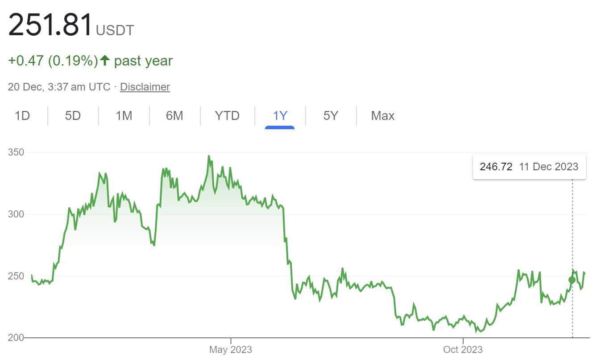

# Why has the BNB Coin Price Performed so Badly?

This week our Marketing Manager asked why the BNB price had fallen so far this year. We had the same question from a customer chatting with our Help Desk; and also saw a similar question in a Facebook forum. Here's our analysis and reply.

Since earlier this year the BNB coin price has fallen by about 30%, while BTC has gained 30%. The cryptocurrency market in general has been strong in the second half of 2023, so why has BNB flopped?

#### What is BNB?

BNB is the cryptocurrency native coin of the BNB Chain ecosystem. As a popular utility token, you trade BNB like any other cryptocurrency, you can also use BNB in a wide range of applications and use cases on the Binance blockchains.

BNB is an ERC-20 token on the Ethereum network, a BEP-2 on the BNB Beacon Chain (formerly Binance Chain), and a BEP-20 token on the BNB Smart Chain(formerly Binance Smart Chain).

BNB powers the BNB Chain ecosystem and is the native coin of the BNB Beacon Chain and BNB Smart Chain. BNB has several use cases:

* Reduced trading fees on the Binance exchange;
* Pay for trading fees on Binance DEX (Decentralized Exchange);
* Pay for transaction fees on the BNB Beacon Chain and the BNB Smart Chain;
* Pay for goods and services for both online and in-store purchases (e.g., using Binance Card or Binance Pay);
* Community utility token on the BNB Chain ecosystem (such as games and DApps);
* Participate in token sales hosted on the Binance Launchpad;
* Donate on Binance Charity;
* Provide liquidity on Binance Liquid Swap.

These use cases create utility and drive demand for the BNB coin, which is positive for the price.

A second driver of demand for BNB is that some of the Binance profits are used to buy and "burn" BNB tokens. This reduces the supply of BNB, which should increase the BNB price.

### What went wrong?

Many factors that drive markets, and it's not easy to be definitive with large and complex markets. Often it is expectations, rather than facts that drive markets. Here are two issues that we suggest have caused the BNB price to flop:

#### Competing Blockchains

For a while, the Binance blockchains offered advantages over Bitcoin and Ethereum. These advantages included greater utility, faster block transfer times, and lower blockchain transaction fees.

However, 2023 has seen advances in the Bitcoin blockchain, and a major upgrade as Ethereum 2. The use-case for Binance blockchains has weakened.

Also in 2023, newer competing blockchains, including Polygon, Solana, Flow and Arbitrum have risen. Projects, and subsequent blockchain fees that would have needed BNB, have instead gone to different blockchains. This means less demand for BNB, both in the short and longer term.

#### Binance Business Problems

Binance profits can be used to buy and burn BNB, which reduces supply in the market, and shnot beean ould increase the price.

2023 has been difficult for Binance.

Binance has become a crypto-only exchange after compliance failures caused the loss of fiat currency banking facilities. This makes it harder for Biance to compete with other exchanges, and it's reasonable to expect the market share and profits of Binance to fall. The result is less funds to buy and burn BNB tokens.

On top of this, the SEC prosecution and settlement costing USD 2.3b has taken more cash from Binance that could have been used to buy and burn BNB tokens.

The end result is less demand and greater supply of BNB tokens - the price had to fall. These problems for Binance are not short-term or easy to fix. Our view is that the future of BNB is not bright.
