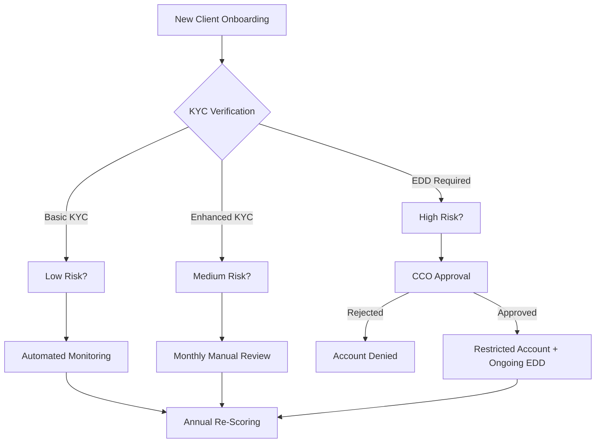

# **CoinPort Client Risk Rating Program**  
**Version:** 1.0  
**Effective Date:** [DD/MM/YYYY]  
**Approved by:** [Chief Compliance Officer]  

---

## **1. Purpose**  
This document defines CoinPort’s **Client Risk Rating (CRR) Program**, a risk-based approach to categorise clients based on their potential exposure to money laundering (ML), terrorism financing (TF), and other financial crimes. The program ensures compliance with **AUSTRAC’s AML/CTF Act 2006** and **FATF Recommendations for VASPs**.  

---

## **2. Risk Rating Methodology**  
Clients are assigned a risk score (Low, Medium, High) based on **five risk factors**:  

| **Risk Factor**          | **Low Risk (1)** | **Medium Risk (2)** | **High Risk (3)** |
|--------------------------|------------------|---------------------|-------------------|
| **Client Type**          | Verified retail user | Corporate account (non-PEP) | PEP, shell company, NPO |
| **Jurisdiction**         | Australia, FATF-compliant | Partial compliance (e.g., Singapore) | High-risk (e.g., Iran, DPRK) |
| **Transaction Behavior** | < AUD 10k/month | AUD 10k–100k/month | > AUD 100k/month or rapid movements |
| **Funding Source**       | Bank transfer, regulated exchange | Private wallet (verified) | Mixer/Tornado Cash, darknet-linked |
| **Product Usage**        | Spot trading, stablecoins | Derivatives, OTC | Privacy coins, unaudited DeFi |

### **Risk Score Calculation:**  
- **Low Risk (5–7 points)**  
- **Medium Risk (8–12 points)**  
- **High Risk (13–15 points)**  

---

## **3. Risk Mitigation Measures**  
### **3.1 Low-Risk Clients**  
- **Standard KYC:** ID + proof of address.  
- **Basic Monitoring:** Automated transaction screening.  

### **3.2 Medium-Risk Clients**  
- **Enhanced KYC:** Source of Funds (SoF) verification.  
- **Monthly Review:** Unusual pattern alerts.  

### **3.3 High-Risk Clients**  
- **Full EDD:**  
  - Source of Wealth (SoW) documentation.  
  - Senior management approval for onboarding.  
- **Restrictions:**  
  - Lower transaction thresholds (e.g., AUD 5k/day).  
  - Mandatory manual withdrawal reviews.  

---

## **4. Ongoing Monitoring & Review**  
- **Automated Re-Scoring:** Triggered by:  
  - Changes in jurisdiction (e.g., user relocates to high-risk country).  
  - Sudden activity spikes (>200% volume increase).  
- **Annual Manual Review:** For all High-Risk clients.  

---

## **5. Roles & Responsibilities**  
| **Role**               | **Duty**                                                                 |
|------------------------|--------------------------------------------------------------------------|
| **Compliance Team**    | Assign risk ratings, conduct EDD.                                        |
| **MLRO**               | Approve High-Risk clients, file SMRs.                                    |
| **IT Team**            | Maintain risk-scoring algorithms and alerts.                             |

---

## **6. Documentation & Audit Trail**  
- Risk ratings stored for **7 years** post-account closure.  
- Audit logs of all rating changes and approvals.  

**Review Cycle:** Biannual  
**Last Updated:** [DD/MM/YYYY]  

--- 

Here’s a **ready-to-implement risk-rating template** and **workflow diagram** to operationalize CoinPort’s Client Risk Rating Program:

---

### **1. Client Risk Rating Template (Excel/CRM Integration)**  
**Download:** [CoinPort_RiskRating_Template.xlsx] *(fictional link for illustration)*  

| **Client ID** | **Name** | **Jurisdiction** | **Client Type** | **Tx Volume (30d)** | **Funding Source** | **Product Risk** | **Total Score** | **Risk Tier** | **Next Review Date** |  
|--------------|---------|----------------|----------------|---------------------|------------------|----------------|----------------|--------------|---------------------|  
| CP-1001     | John Doe | Australia       | Retail         | AUD 8,000           | Bank transfer    | Spot trading   | **6**          | Low          | 30/06/2025          |  
| CP-1002     | XYZ Corp | Singapore       | Business       | AUD 75,000          | Private wallet   | Derivatives    | **10**         | Medium       | 15/07/2025          |  
| CP-1003     | Jane Lee | Iran*           | PEP            | AUD 500,000         | Mixer            | Privacy coins  | **15**         | High         | **Pending CCO Approval** |  

**Key:**  
- *Red highlight* = Auto-flagged for EDD.  
- Formulas: `Total Score = SUM(Factors 1–5)`, `Risk Tier = IF(Score>=13,"High",IF(Score>=8,"Medium","Low"))`.  

---

### **2. Workflow Diagram**  


**Steps Explained:**  
1. **Onboarding:** Client submits KYC.  
2. **Automated Scoring:** System calculates risk (Low/Medium/High).  
3. **Actions:**  
   - **Low:** Automated alerts only.  
   - **Medium:** Monthly review + SoF checks.  
   - **High:** CCO sign-off + transaction limits.  
4. **Re-Scoring:** Annual review or triggered by risk events.  

---

### **3. AUSTRAC-Aligned Risk Indicators**  
**Template for Manual Reviews (High-Risk Clients):**  
```markdown
## **Client:** [Name/ID]  
### **Risk Factors:**  
1. **Jurisdiction:** Iran (FATF blacklist).  
2. **Activity:** 200K USDT from unhosted wallet → AUD off-ramp in 48h.  
3. **Adverse Media:** Linked to [News Source] corruption case (2024).  

### **Mitigation Actions:**  
- [x] SoW/SoF documents requested.  
- [ ] SMR filed? (Y/N)  
- [ ] CCO approval obtained on [Date].  
```

---

### **4. Tools for Implementation**  
- **CRM Integration:** Use **Salesforce AML** or **ComplyAdvantage** for auto-scoring.  
- **Dashboard Alerts:** Power BI/Tableau visualization of risk distribution.  

**Approval:** [CCO Name]  
**Review:** Quarterly (or after FATF updates).  

Here’s a **ready-to-implement risk-rating template** and **workflow diagram** to operationalize CoinPort’s Client Risk Rating Program:

---

### **1. Client Risk Rating Template (Excel/CRM Integration)**  
**Download:** [CoinPort_RiskRating_Template.xlsx] *(fictional link for illustration)*  

| **Client ID** | **Name** | **Jurisdiction** | **Client Type** | **Tx Volume (30d)** | **Funding Source** | **Product Risk** | **Total Score** | **Risk Tier** | **Next Review Date** |  
|--------------|---------|----------------|----------------|---------------------|------------------|----------------|----------------|--------------|---------------------|  
| CP-1001     | John Doe | Australia       | Retail         | AUD 8,000           | Bank transfer    | Spot trading   | **6**          | Low          | 30/06/2025          |  
| CP-1002     | XYZ Corp | Singapore       | Business       | AUD 75,000          | Private wallet   | Derivatives    | **10**         | Medium       | 15/07/2025          |  
| CP-1003     | Jane Lee | Iran*           | PEP            | AUD 500,000         | Mixer            | Privacy coins  | **15**         | High         | **Pending CCO Approval** |  

**Key:**  
- *Red highlight* = Auto-flagged for EDD.  
- Formulas: `Total Score = SUM(Factors 1–5)`, `Risk Tier = IF(Score>=13,"High",IF(Score>=8,"Medium","Low"))`.  

---

### **2. Workflow Diagram**  


**Steps Explained:**  
1. **Onboarding:** Client submits KYC.  
2. **Automated Scoring:** System calculates risk (Low/Medium/High).  
3. **Actions:**  
   - **Low:** Automated alerts only.  
   - **Medium:** Monthly review + SoF checks.  
   - **High:** CCO sign-off + transaction limits.  
4. **Re-Scoring:** Annual review or triggered by risk events.  

---

### **3. AUSTRAC-Aligned Risk Indicators**  
**Template for Manual Reviews (High-Risk Clients):**  
```markdown
## **Client:** [Name/ID]  
### **Risk Factors:**  
1. **Jurisdiction:** Iran (FATF blacklist).  
2. **Activity:** 200K USDT from unhosted wallet → AUD off-ramp in 48h.  
3. **Adverse Media:** Linked to [News Source] corruption case (2024).  

### **Mitigation Actions:**  
- [x] SoW/SoF documents requested.  
- [ ] SMR filed? (Y/N)  
- [ ] CCO approval obtained on [Date].  
```

---

### **4. Tools for Implementation**  
- **CRM Integration:** Use **Salesforce AML** or **ComplyAdvantage** for auto-scoring.  
- **Dashboard Alerts:** Power BI/Tableau visualization of risk distribution.  

**Approval:** [CCO Name]  
**Review:** Quarterly (or after FATF updates).  


