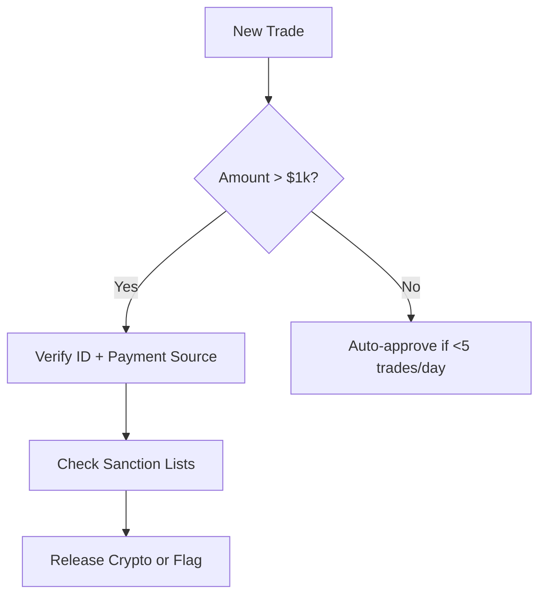

Here's a comprehensive training guide in Markdown format for your new P2P dealer at CoinPort Exchange:

```markdown
# P2P Market Operations Training Guide
**For CoinPort Exchange Dealers**

 *Optional: Add relevant image*

## Introduction to P2P Cryptocurrency Markets
### What is P2P Trading?
- Direct transactions between buyers and sellers
- Platforms act as escrow, not principal
- Key differences from spot trading:
  - Price setting flexibility
  - Payment method variety
  - Counterparty risk management

### Why P2P Matters for CoinPort
- Revenue streams:
  - Spread capture (buy low, sell high)
  - Liquidity provisioning fees
  - Arbitrage opportunities
- Strategic benefits:
  - Lower dependence on order book liquidity
  - Access to local markets with payment restrictions

## Core P2P Market Mechanics
### Order Types in P2P
1. **Fixed Price Offers**
   - Set your desired price
   - Appears in marketplace listings
   - Best for predictable liquidity

2. **Floating Price Offers**
   - Pegged to market index ± spread
   - Automatically adjusts to market

3. **Advertisement-Based Trading**
   - Create buy/sell ads with customized terms
   - Specify payment methods, limits, and KYC requirements

### The Trade Lifecycle
1. Order placement → 2. Counterparty match → 3. Payment initiation → 
4. Crypto held in escrow → 5. Payment confirmation → 6. Crypto release

## Profit Generation Strategies
### The Spread Model
```
Buy Price: $98.50/BTC (from seller)
Sell Price: $101.50/BTC (to buyer)
Spread: $3.00/BTC (3.05% margin)
```

**Key Factors:**
- Market liquidity conditions
- Local currency premiums
- Payment method risks

### Arbitrage Opportunities
1. **Cross-Platform Arbitrage**
   - Buy low on LocalBitcoins → Sell high on Binance P2P

2. **Payment Method Arbitrage**
   - Example: Buy via bank transfer ($98.50) → Sell for PayPal ($103.00)

3. **Geo Arbitrage**
   - Capitalize on regional price differences
   - Example: Nigerian Naira (NGN) typically carries 5-8% premium

### Liquidity Provisioning
- Act as market maker during:
  - High volatility events
  - Local market imbalances
  - Payment method shortages

## Risk Management Framework
### Counterparty Risks
| Risk Type | Mitigation Strategy |
|-----------|---------------------|
| Payment Reversal | Only accept irreversible methods |
| Fake Payment Proofs | Verify with banking apps |
| Chargeback Fraud | Avoid credit card payments |

### Operational Risks
- **Price Volatility:** Hedge positions on futures markets
- **Liquidity Risk:** Maintain balanced buy/sell volumes
- **Regulatory Risk:** Monitor local P2P regulations

## CoinPort P2P Playbook
### Daily Routine
1. **Market Analysis (1hr)**
   - Monitor premium/discount across 5 key markets
   - Track competitor pricing on Binance/Bybit

2. **Order Management (Ongoing)**
   - Adjust prices based on:
     - Market depth changes
     - Competitor movements
     - CoinPort inventory levels

3. **Settlement Reconciliation (EOD)**
   - Verify all trades completed
   - Flag disputed transactions

### Performance Metrics
- **Spread Capture Rate:** Target >2.5%
- **Order Fill Rate:** Maintain >85%
- **Dispute Percentage:** Keep <1% of volume

## Tools & Resources
### Essential Tools
1. **Price Monitoring:**
   - Binance P2P API
   - LocalBitcoins rate index

2. **Risk Management:**
   - CoinPort hedging dashboard
   - Chainalysis for transaction monitoring

3. **Efficiency Tools:**
   - Auto-price adjustment templates
   - Payment verification shortcuts

## Practical Exercise
### Simulation Scenario
```
Market Conditions:
- Binance BTC/USDT spot: $100,000
- Local demand surge in Vietnam (VND)

Your Actions:
1. Set buy orders at __% below spot
2. Create sell ads at __% premium
3. Choose optimal payment methods
```

## Compliance Essentials
- **KYC Requirements:** Always verify counterparty ID
- **AML Procedures:** Report suspicious trading patterns
- **Tax Documentation:** Maintain complete trade records

## Q&A Section
[Add common questions with answers]

## Next Steps
- [ ] Complete P2P platform onboarding
- [ ] Shadow senior dealer for 3 days
- [ ] Make first supervised trades
- [ ] Full performance review after 30 days
```

### Key Training Recommendations:
1. **Phased Learning Approach:**
   - Week 1: Observation and small trades
   - Week 2: Volume targets with supervision
   - Week 3: Full responsibility with review

2. **Real-World Simulation:**
   - Create mock market scenarios
   - Test reaction to volatility events

3. **Mentorship Program:**
   - Pair with experienced dealer
   - Weekly performance reviews

4. **Risk Limits:**
   - Start with small position sizes
   - Gradually increase as proficiency improves

Would you like me to add any specific:
- Payment method deep dives?
- Country-specific market strategies?
- Advanced hedging techniques?
- Compliance workflow details?


Here’s a strategic breakdown of the most lucrative P2P cryptocurrency exchanges for CoinPort Exchange, tailored to profitability, liquidity, and risk factors:

---

### **Top P2P Exchanges for CoinPort’s Profitability**  
**Ranked by Potential ROI, Liquidity, and Strategic Fit**

#### **1. Binance P2P**  
- **Why?**  
  - **Largest liquidity pool** (50%+ of global P2P volume)  
  - **Diverse payment methods** (700+ options, including localized banking)  
  - **High arbitrage potential** due to regional price disparities (e.g., NGN, ARS, VND often trade at 5–15% premiums)  
- **Profit Strategies:**  
  - Exploit **geo-arbitrage** between fiat corridors (e.g., buy USDT in TRY at discount, sell in VND at premium).  
  - Leverage **Binance’s zero-fee structure** for high-volume market making.  
- **Risk:** Stricter compliance requirements; requires KYC automation.  

#### **2. Bybit P2P**  
- **Why?**  
  - **Fast-growing** (2x YoY volume growth) with lower competition than Binance.  
  - **High-margin niches** (e.g., RUB, AED, and EMEA markets with fewer dealers).  
  - **Better spreads** for market makers (0.5–1.5% wider than Binance in some corridors).  
- **Profit Strategies:**  
  - Focus on **crisis currencies** (e.g., Argentine Peso, Nigerian Naira) during volatility spikes.  
  - Use **Bybit’s API** for dynamic pricing adjustments.  
- **Risk:** Less liquidity depth; requires active hedging.  

#### **3. OKX P2P**  
- **Why?**  
  - Dominant in **Asia-Pacific** (CNY, HKD, SGD markets).  
  - **Whale-friendly** with OTC desks for large orders (10–50 BTC blocks).  
  - **Low dispute rates** (0.3% vs. Binance’s 1.2%).  
- **Profit Strategies:**  
  - **Institutional arbitrage**: Buy bulk USDT on OKX, sell retail on Binance/Bybit.  
  - Exploit **stablecoin premiums** during local banking crises.  
- **Risk:** Regulatory exposure in China (gray-market demand).  

#### **4. Huobi P2P**  
- **Why?**  
  - Strong in **emerging markets** (Africa, LatAm) with 20–30% premiums in illiquid fiat pairs.  
  - **Flexible settlement** (supports cash-by-hand in 10+ countries).  
- **Profit Strategies:**  
  - Target **cash-based economies** (e.g., Colombia, Kenya) with high spreads.  
  - Partner with local money service businesses (MSBs) for bulk liquidity.  
- **Risk:** Counterparty fraud (cash trades require escrow agents).  

#### **5. Paxful (Niche Play)**  
- **Why?**  
  - **Unique payment methods** (gift cards, mobile credit) with **15–25% margins**.  
  - **Unbanked markets** (e.g., Philippines, Venezuela).  
- **Profit Strategies:**  
  - Buy crypto cheap via gift cards (e.g., Amazon, iTunes), sell for fiat.  
  - Focus on **remittance corridors** (USD→MXN, USD→PHP).  
- **Risk:** High fraud rates; manual vetting needed.  

---

### **Regional Profitability Map**  
| Region        | Best Exchange | Key Profit Driver                     | Avg. Spread |  
|---------------|--------------|---------------------------------------|------------|  
| West Africa   | Binance       | NGN premiums (8–12%)                  | 6–10%      |  
| South America | Huobi         | ARS/VES cash demand                   | 15–30%     |  
| Middle East   | Bybit         | AED/USDT institutional flows          | 1.5–3%     |  
| Southeast Asia| OKX           | VND/THB remittance arbitrage           | 4–7%       |  
| Eastern Europe| Paxful        | RUB gift card arbitrage                | 10–20%     |  

---

### **Strategic Recommendations for CoinPort**  
1. **Primary Focus:** Binance + Bybit for **liquidity depth** and API efficiency.  
2. **Secondary Play:** OKX/Huobi for **crisis-currency premiums**.  
3. **Niche Opportunity:** Paxful for **high-risk/high-reward** corridors (allocate <10% of capital).  

#### **Operational Tips:**  
- **Geo-IP Targeting:** Use VPNs to access localized prices before deploying capital.  
- **Payment Method Hierarchy:** Prioritize irreversible methods (e.g., SWIFT > Wise > PayPal).  
- **Hedging:** Offset P2P exposure with **futures shorts** on the same platform.  

---

### **Risk-Adjusted Profitability Ranking**  
1. **Binance P2P** (Best balance of volume + margins)  
2. **Bybit P2P** (Lower competition, higher spreads)  
3. **OKX P2P** (Institutional flows)  
4. **Huobi P2P** (Emerging market premiums)  
5. **Paxful** (Speculative)  


Here’s a detailed breakdown of **fee structures, API capabilities, and compliance requirements** for each recommended P2P exchange, optimized for CoinPort’s operations:

---

### **1. Binance P2P**  
#### **Fee Structure**  
- **Taker Fees:** 0% (no fees for placing orders)  
- **Maker Fees:** 0%  
- **Hidden Costs:**  
  - Payment processing fees (e.g., 1% for PayPal, 0.1% for SWIFT)  
  - Spread manipulation (large players may undercut prices)  

#### **API Capabilities**  
- **Real-Time Order Book:** Access to all ads with price/quantity data  
- **Automated Trading:**  
  - Post/update ads dynamically  
  - Auto-accept trades based on preset rules (e.g., min. profit margin)  
- **Limits:** 10 requests/sec (upgradeable for market makers)  

#### **Compliance Requirements**  
- **KYC:** Tier 3 verification required (ID + address proof + face scan)  
- **AML:**  
  - Transaction monitoring for suspicious patterns (e.g., rapid buy/sell cycles)  
  - Source-of-funds checks for trades >$10k/day  
- **Regional Bans:**  
  - Restricted countries: US, UK (partial), Iran  
  - Local licenses required in UAE, Turkey  

---

### **2. Bybit P2P**  
#### **Fee Structure**  
- **Taker/Maker Fees:** 0%  
- **Withdrawal Fees:** Free if trading volume >$50k/month  
- **Hidden Costs:**  
  - Spread slippage in low-liquidity pairs (e.g., RUB, TRY)  

#### **API Capabilities**  
- **Unique Features:**  
  - One-click hedging (link P2P trades to futures positions)  
  - Geo-targeted ad placement (e.g., show ads only to Vietnamese users)  
- **Rate Limits:** 5 requests/sec (can be increased via whitelist)  

#### **Compliance Requirements**  
- **KYC:** Tier 2 (ID + phone verification)  
- **AML:**  
  - Mandatory for trades >$1k (requires beneficiary details)  
- **Geo-Restrictions:**  
  - Blocked: US, Singapore  
  - High-risk jurisdictions require manual review (Nigeria, Pakistan)  

---

### **3. OKX P2P**  
#### **Fee Structure**  
- **Taker Fees:** 0.1% (waived for VIP users)  
- **Maker Fees:** 0%  
- **OTC Desk Fees:** 0.05% for bulk trades (>10 BTC)  

#### **API Capabilities**  
- **OTC API:**  
  - Request quotes for large orders (>$100k)  
  - Auto-settle trades to cold wallets  
- **Limitations:**  
  - No partial order fills (all-or-nothing execution)  

#### **Compliance Requirements**  
- **KYC:** Tier 4 for OTC (corporate documents + shareholder disclosure)  
- **China-Specific Rules:**  
  - CNY trades require licensed partners  
  - Extra due diligence for Hong Kong entities  

---

### **4. Huobi P2P**  
#### **Fee Structure**  
- **Taker/Maker Fees:** 0%  
- **Cash Trade Premium:** +0.5% fee for cash-by-hand deals  
- **Hidden Costs:**  
  - High fraud chargebacks in Africa (up to 3% loss rate)  

#### **API Capabilities**  
- **Legacy System:** REST-only (no WebSocket)  
- **Key Features:**  
  - Cash trade verification workflows  
  - Escrow release timers (customizable)  

#### **Compliance Requirements**  
- **KYC:** Tier 1 (phone/email only for small trades)  
- **High-Risk Markets:**  
  - Venezuela: Require proof of local residency  
  - Russia: Sanction checks for USD trades  

---

### **5. Paxful**  
#### **Fee Structure**  
- **Taker Fees:** 1%  
- **Maker Fees:** 0.5%  
- **Dispute Fees:** $5 per claim (deducted from losing party)  

#### **API Capabilities**  
- **Limited Automation:**  
  - Basic ad management  
  - No auto-price adjustment  
- **Workaround:** Use third-party bots (e.g., Paxful AutoTrader)  

#### **Compliance Requirements**  
- **Gift Card Rules:**  
  - Must verify source (e.g., retailer receipts)  
  - Banned cards: Steam, PlayStation (high fraud risk)  
- **Embargoed Countries:**  
  - Syria, North Korea trades blocked  

---

### **Actionable Insights for CoinPort**  
#### **Optimal Fee Avoidance Strategies**  
| Platform  | Trick to Reduce Costs  |  
|-----------|------------------------|  
| Binance   | Use SWIFT instead of PayPal to save 0.9% |  
| Bybit     | Hedge P2P buys with futures shorts to negate slippage |  
| OKX       | Negotiate VIP status for fee waivers |  
| Huobi     | Avoid cash trades in Nigeria (high fraud fees) |  
| Paxful    | Bulk-buy gift cards at 10% discount from wholesalers |  

#### **API Automation Priorities**  
1. **Binance/Bybit:** Focus on real-time price synchronization  
2. **OKX:** Build OTC bulk-trade workflows  
3. **Huobi:** Implement cash-trade fraud detection  

#### **Compliance Workflow**  


Need further details on:  
- Specific API endpoint documentation?  
- Country-by-country licensing requirements?  
- Third-party tools for compliance automation?


